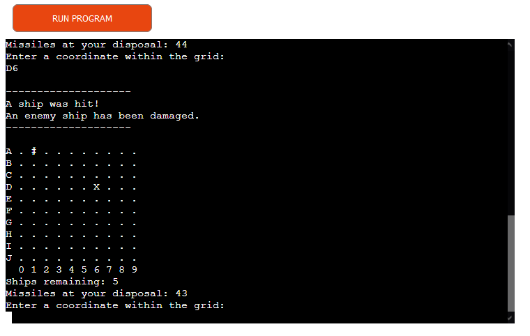
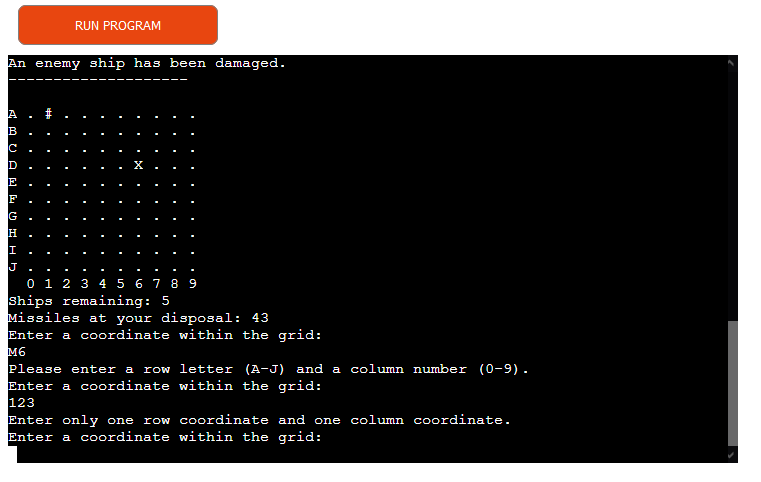

# Grid Wars

Grid Wars is a game that is all about trying to find all enemy ships and destroy them before you run out of missiles. All enemy ships are randomly placed and are of different sizes. The ships are hidden and it is up to the player to guess their position by entering a set of coordinates. A missile is fired each time a set of coordinates is entered.

The game is a Python terminal game and is played in a mock terminal on Heroku created by Code Institiute.

A live version of the project can be found [here](https://grid-wars1.herokuapp.com/).

## How to play

Each game starts by generating a grid with five hidden enemy ships on it. The player is given 45 missiles and is tasked with eliminating all enemy ships before he or she runs out of missiles. Each enemy ships is of a randomly chosen size, and a ship will not be destroyed until all parts of the ship are hit. In order to guess the position of a ship, and fire a missile, the player must enter a set of coordinates. The coordinates must be composed of one alphabetical letter between the letter A and the letter J as well as a number between the number 0 and the number 9. 

The player wins when all enemy ships are destroyed, and if the player runs out of missiles the game is lost.

Each coordinate is represented by a '.', and each enemy ship is represented by a 'O'(hidden to the player). As the player fires a missile the chosen coordinate will be marked by either a '#', which represents a miss, or an 'X', which represents a part of a ship that was hit.

The game ends when either all ships are destroyed or the player runs out of missiles.

## Features

### Existing Features

* Random game grid generation
  - Ship placement and ship size is randomly chosen by the computer
  - Ships are hidden from the player

* Keeps track of the number of missiles and enemy ships remaining
  - Informs the player when either the victory or the fail condition has been met

* Informs the player whether an attack was a miss, a hit or completely destroyed a ship

* Accepts player input
  - Each player input is validated
  - Player cannot enter coordinates outside the grid
  - Player cannot attack the same position twice
  - Player must enter one letter between A and J and a number between 0 and 9

### Future Features

* Add a player board that the computer can attack

* Add the ability to play against another player

* Score board

## Data Model

The data model for this project is simply a collection of functions that work together to create the game. Each function uses one or several global variables, and each one performs a unique function that may or may not be dependent on a previously created function. They are all tied together by the final function that runs the game.

## Testing

The project has been manually tested by doing the following:

* Running the code through Code Institute's Python linter and confirming that there are no problems with the code

* Running the game both in my local terminal and in the Code Institute Heroku terminal
  - Multiple game sessions where played
  - Both invalid and valid inputs were given to test game behavior

### Bugs

#### Solved Bugs

* I had written '= False' instead of 'is False' in the while-loop used by the function that checks wether a coordinate is valid or not. I fixed it by changing the equals sign to 'is'.

### Remaining Bugs

* There are no remaining bugs.

### Validator Testing

* No errors were returned when passing the code through Code Institute's Python validator.

## Deployment
  1. Head to Heroku and click the "New" tab and select "Create new app"
  2. Choose a unique app name and click "Create app"
  3. Click to the "Settings" tab and then head down to the "Config vars" section
  4. Click "Reveal Config Vars" and add a Config Var called "PORT" (key) with a value of "8000" (value)
  5. Head down to the "Buildpacks" section and click "Add buildpack"
  6. Choose "Python" save the changes
  7. Add a second buildpack called "nodejs"
  8. Click the "Deploy" tab and go down to the "Deployment method" section
  9. Choose "GitHub" and then search for the project in the new section that appears
  10. Click the "Connect" button once the project has been found
  11. Choose either "Enable Automatic Deploys" in the "Automatic deploys" section or "Deploy Branch" in the "Manual Deploy" section

  ## Credits

  * Code Institute for the deployment terminal